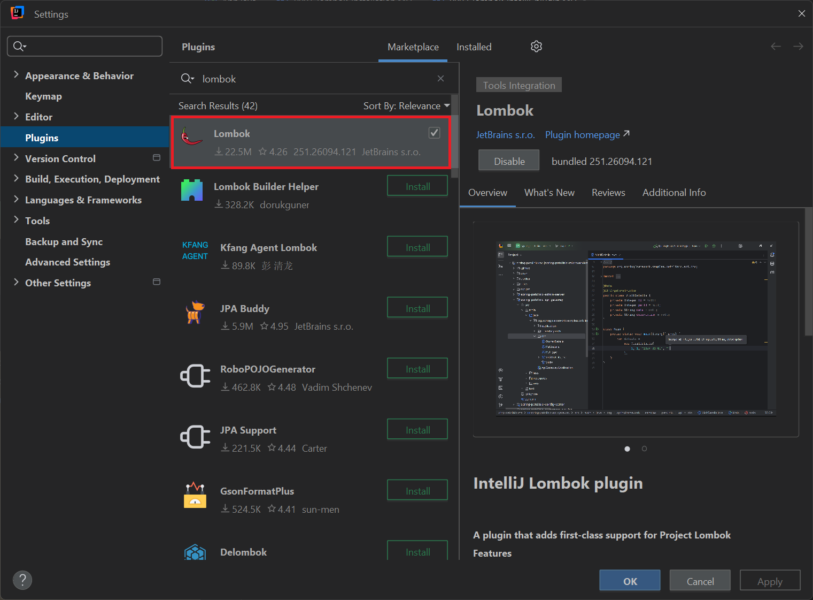
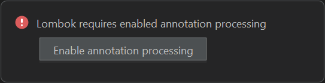

# Lombok IntelliJ Plugin

## Table of Contents

<!-- TOC -->
* [Lombok IntelliJ Plugin](#lombok-intellij-plugin)
  * [Table of Contents](#table-of-contents)
  * [IntelliJ IDE Integration](#intellij-ide-integration)
    * [Install Lombok plugin](#install-lombok-plugin)
    * [Enable Annotation Processing When Running](#enable-annotation-processing-when-running)
    * [Final Check](#final-check)
<!-- TOC -->

## IntelliJ IDE Integration

### Install Lombok plugin

You need to check if Lombok plugin is already installed on your IntelliJ IDE like the picture below:



> You can manually download the plugin from here:
>
> https://plugins.jetbrains.com/plugin/6317-lombok

### Enable Annotation Processing When Running

When running the application in your local environment, click `Enable annotation processing` when prompted, like below:



### Final Check

Finally, do a clean Maven build to verify if your project can compile successfully

```shell
mvn clean install -DskipTests
```

`-DskipTests` can be specified (or not) if you do not need to run the unit tests for the time being.

You can also test the application by building the docker image (if possible), to see if your project will work in
containerized environment.